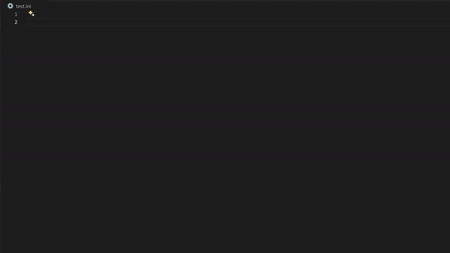

  

# ZeroSyntax-Highlight

## Introduction
**ZeroHour-Highlight** is a simple syntax highlighter for map.ini files in Command & Conquer Generals Zero Hour. This project aims to provide a simple and easy syntax highlighting to help find errors, structure and understand the map.ini file.
The project will firstly focus on supporting map.ini files which works in the basegame (not modded). With this said, the highligher have mostly been tested in Zero Hour, but should work in vanilla (none zero hour).

## Showcase

## Issues
If you find any issues with the syntax highlighter, please create an issue on the [Github Page](https://github.com/ViTeXFTW/ZeroSyntax-Highlight/issues). This will help me to fix the issue and make the highlighter better. Please provide as much information as possible when creating an issue, this makes it much easier and more likely that the issue will be fixed.

## Contributing  
If you want to contribute to the project, please take a look at the [CONTRIBUTING.md](./CONTRIBUTING.md) file.

## Contributors

<!-- ALL-CONTRIBUTORS-LIST:START - Do not remove or modify this section -->
<!-- prettier-ignore-start -->
<!-- markdownlint-disable -->

<!-- markdownlint-restore -->
<!-- prettier-ignore-end -->

<!-- ALL-CONTRIBUTORS-LIST:END -->

## License
This projct is under the [MIT LICENSE](./LICENSE).

## Suggestions
As this is my first open-source project, if you have any ideas or suggestions please write to me on eithre Discord or mail. (Discord might be better)

## Questions
Discord: ViTeXFTW#6644  
Mail: vitexftw@gmail.com
